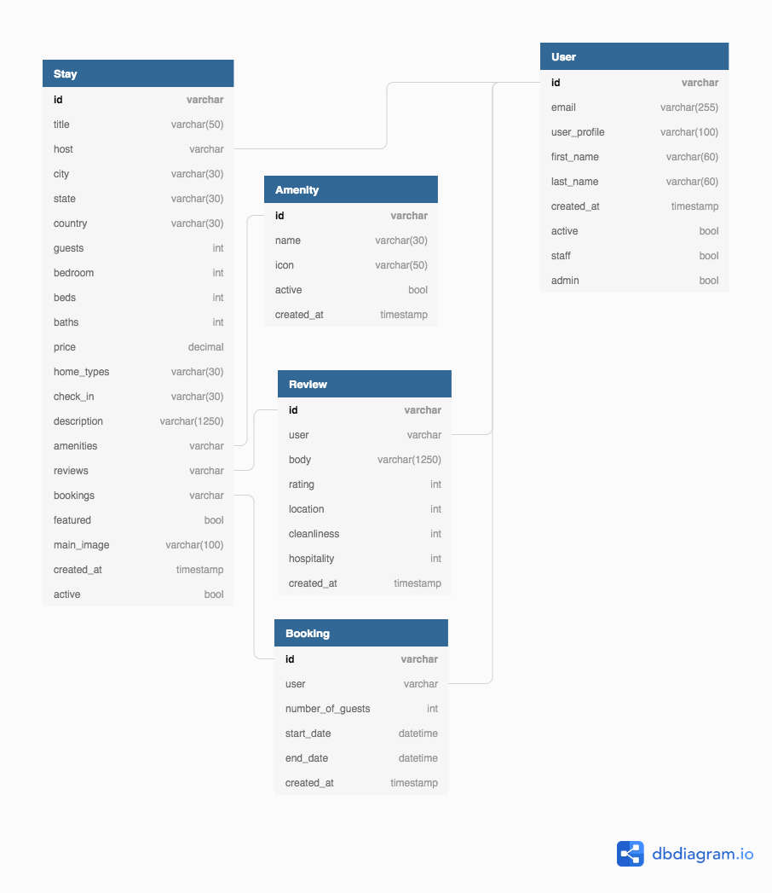

# Hygge Homes

This repository contains a full-stack web application to search and book vacation homes created with Python 3.6+, HTML and CSS.

What is Hygge? Hygge is a Danish and Norwegian word for a mood of coziness and comfortable conviviality with feelings of wellness and contentment.
This inspiration for this project is to create a site where users can search and find the perfect spot for their vacation home, much like Airbnb.

## Table of Contents

- [Tech Stack](#tech-stack)
- [Features](#features)
- [Views](#views)
- [Models](#models)
- [Status](#status)
- [Authors](#authors)

## Tech Stack
- Frontend libraries:
  - Bootstrap
  - Jquery
  - FontAwesome
  - Datepicker
- Backend framework
  - Django 3.0 and Jinja2
- Databases
  - SQLite (development)
  - PostgreSQL (production)
- Deployment
  - Amazon Web Services EC2 (Ubuntu 18.04)
  - Amazon Web Services Elastic IP

This is a portfolio project made by 2 computer science students who want to showcase our web development skills.

Ryuichi Miyazaki: [LinkedIn](https://www.linkedin.com/in/rmiyazaki/)

Tu Vo: [LinkedIn](https://www.linkedin.com/in/tu-vo/)

Check out our other projects at: [Akatsuki Co](https://github.com/akatsuki-co)


### Setting up the `hyggehomes` development server with Docker

For those that are not interested in setting up the project manually or would simply not have to worry about downloading python and its dependencies, we have created a Dockerfile and docker-compose.yml file to help create a container with everything you would need to run the project.

#### Install Docker

To make this as easy as possible, we will be using *Docker Compose* to creat our container.

- If you do not have Docker yet, start by downloading it if you are on a Mac or Windows:
https://www.docker.com/products/docker-desktop

- Or if you are on a Linux Distribution follow the directions here:
https://docs.docker.com/compose/install/

- To confirm you have Docker Compose, open up your terminal and run the command below:

```
$ docker-compose --version
docker-compose version 1.26.2, build eefe0d31
```

#### Build and Run the Container

- Clone the repo to your local machine:

```
$ git clone https://github.com/akatsuki-co/hyggehomes.git
```

- Go into the project directory to build and run the container with:

```
$ cd hyggehomes/
$ docker-compose up -d --build
```

Navigate to http://localhost:8000 to view the site on the local server.


- You can access your container with the command:

```
$ docker exec -it hyggehomes_hyggehomes_1 bash
```

This will take you into the bash session within the container.

#### Cleaning up the Container and Image

To stop the container from running, use `<Ctrl-C>` twice.
To close down the container use the command:

```
$ docker-compose down
```
Then to clean up the container and image which we are no longer using use the command:

```
$ docker system prune -fa
```

Confirm that the container and image is no longer there with:

```
$ docker system df -v
```

## Features

Users can:

- register
- login
- view featured stays
- browse top cities
- search stays by city and/or location
- book stays

### API Integrations

#### Stripe

We accept and process credit card payments for bookings using Stripe's API.

#### Unsplash

Images for all of the stays are completely random and are rendered dynamically using Unsplash's API.

#### Mapbox

Maps of cities are rendered using Mapbox's API.

## Views

### Landing


### Explore


### City


### Detail


### My Trips


## Models

Our data has 5 schemas:

- Amenity
- Booking
- Review
- Stay
- User



### Relationships

A user has a one-to-many relationship to review, booking and stay.
A stay has a many-to-many relationship to amenity, review, and booking.

## Status

Project is complete and deployed!
Check it out here: https://hyggehomes.dev

## Authors

Created by:

- [Ryuichi Miyazaki](https://github.com/rmiyazaki6499)
- [Tu Vo](https://github.com/tuvo1106)
